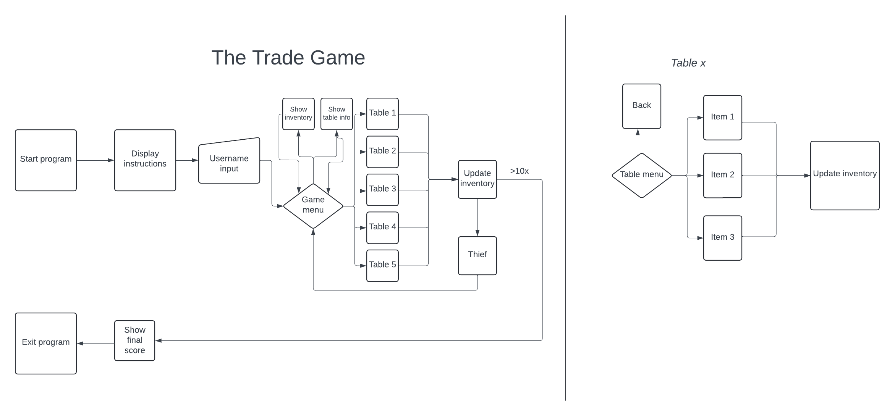

# The Garage Sale
The Garage Sale is a trading game - the user visits a garage sale and tries to
trade up from thumbtack to the highest valuble item. There are no prices at
the garage sale, the user must figure out which items the vendors are 
most likely to be willing to trade.

The game is inspired by *The Office* episode *Garage Sale*.

img of site

Find the site [here](https://the-garage-sale-60683b5891c9.herokuapp.com/)

## Table of Contents
* [User Experience](#user-experience)
    * [User Stories](#user-stories)

## User Experience
The Garage Sale game is a quick and in some way simple game. The user chooses itself when to finish the game. The amounts of allowed visits to the vendors is infinite but aswell as getting a higher valued item the user can leave them with a lower valued item.

### How to play
The user start with an inventory of a thumbtack. They can then choose to meet a vendor to trade that item with one of the five items the vendor possesses. If the vendor find the trade acceptable, the item changes hand. Aswell does the thumbtack. Hopefully, the users new item is more valuble than the thumbtack.

Some vendors are easier to trade with than other.

### Project Goals
The goals of the project are:
* Create a game with no errors or crashes
* Deply the game in a way that it's playable when access to link is given
* Have recurring users (not measurable at the moment)

### User Goals
As a user, I want to:
* In a clear and effective way, recieve the instructions to the game
* Play a game with no errors or crashes
* Feel the game's difficulty level is balanced
* Be able to see my final score

### User Stories

## Features
### Flowchart
Below is the flowchart created before the building of the application started.

### Existing Features
### Future Features

## Technologies Used
### Languages
### Libraries & Tools

## Deployment
### Heroku
### How to fork
### How to clone

## Credits

## Acknowledgments