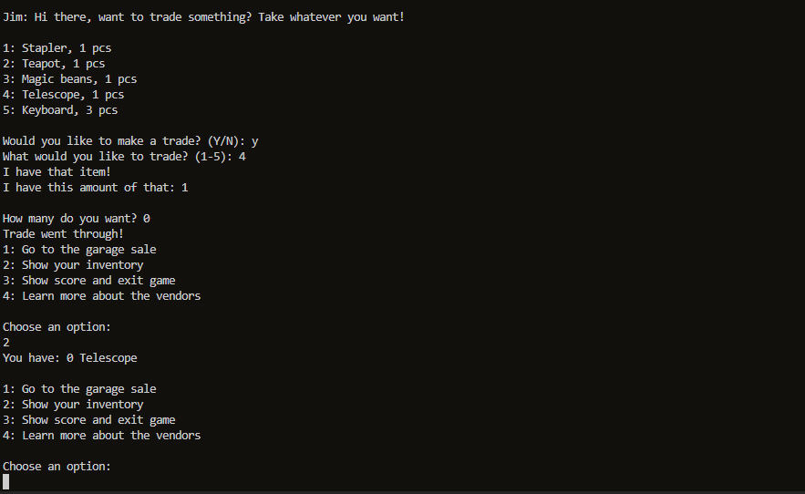
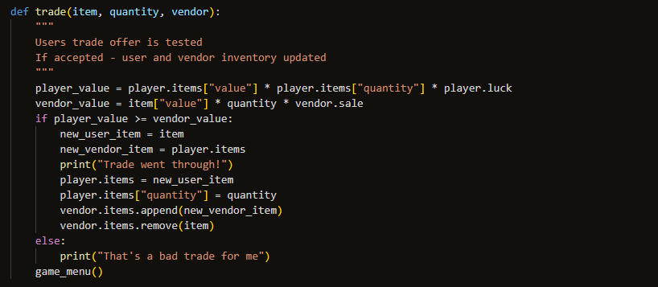
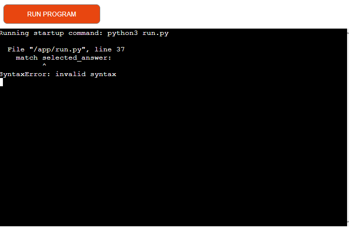
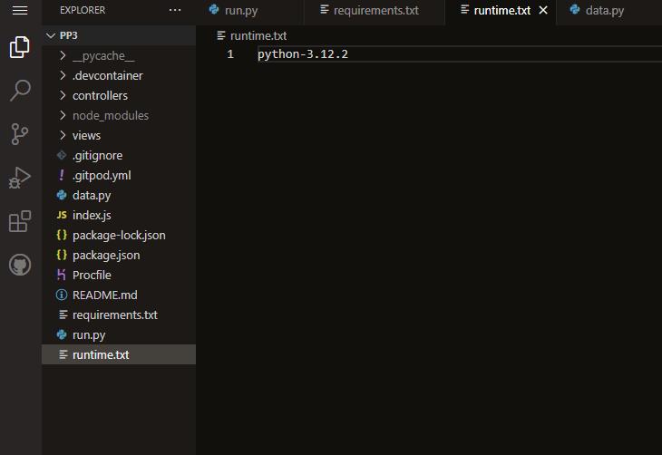

# Testing for The Garage Sale
The Garage Sale is a trading game - the user visits a garage sale and tries to
trade up from thumbtack to the highest valuble item - the telescope. There are 
no prices at the garage sale, the user must figure out which items the vendors are 
most likely to be willing to trade.

The game is inspired by *The Office* episode *Garage Sale*.

img of site

Find the site [here](https://the-garage-sale-60683b5891c9.herokuapp.com/)

Find the link to the Readme [here](README.md)

## Table of Contents
* [Automated testing]()
* [Manual testing]()
* [Bugs]()

### Automated testing
#### Linter validation
This application is validated through [CI Python Linter](https://pep8ci.herokuapp.com/)

Errors that were raised:
* Trailing blankspaces
* Missing empty lines between functions
* Inproper indentation of continuing lines

All errors were fixed and the submitted code features no validation errors.
### Manual testing
|Feature|Test|Outcome|Result|
|---|---|---|---|
|*Invalid inputs*||||
|Username|Only pressing enter|Error message "Please enter a username"|Valid|
|Username|One blankspace|Error message "Please enter a username"|Valid|
|Username|Several blankspaces|Error message "Please enter a username"|Valid|
|Game menu|Only pressing enter|Error message "Please enter a number between 1-4"|Valid|
|Game menu|One blankspace|Error message "Please enter a number between 1-4"|Valid|
|Game menu|Letter|Error message "Please enter a number between 1-4"|Valid|
|Game menu|Number not featured in displayed list|Error message "Please enter a number between 1-4"|Valid|
|Show score and exit game|Only pressing enter|Error message "Something went wrong, please input the letter 'Y' or 'N'."|Valid|
|Show score and exit game|One blankspace|Error message "Something went wrong, please input the letter 'Y' or 'N'."|Valid|
|Show score and exit game|Letter not 'Y' or 'N'|Error message "Something went wrong, please input the letter 'Y' or 'N'."|Valid|
|Show score and exit game|Number|Error message "Something went wrong, please input the letter 'Y' or 'N'."|Valid|
|The Garage Sale|Only pressing enter|Error message "Something went wrong, select a number between 1-5."|Valid|
|The Garage Sale|One blankspace|Error message "Something went wrong, select a number between 1-5."|Valid|
|The Garage Sale|Letter|Error message "Something went wrong, select a number between 1-5."|Valid|
|The Garage Sale|Number not featured in displayed list|Error message "Something went wrong, select a number between 1-5."|Valid|
|At vendor|Only pressing enter|Error message "Something went wrong, select a number between 1-5."|Valid|
|At vendor|One blankspace|Error message "Something went wrong, select a number between 1-5."|Valid|
|At vendor|Letter|Error message "Something went wrong, select a number between 1-5."|Valid|
|At vendor|Number not featured in displayed list|Error message "Something went wrong, select a number between 1-5."|Valid|
|*Features*||||
|Instructions displayed|Run game|Instructions displayed|Valid|
|Go to the garage sale|Select 1 from Game meny|Vendor menu displayed|Valid|
|Show your inventory|Select 2 from Game menu|Correct inventory displayed|Valid|
|Show score|Select 3 from Game menu|Correct score displayed|Valid|
|Exit game|Select 3 from Game menu, input Y|Goodbye message displayed, application exits|Valid|
|Show vendor info|Select 4 from Game menu|Correct information displayed|Valid|
|Choose vendor|Select a vendor from Vendor menu|Correct vendor displayed|Valid|
|Make a successful trade|Select item vendor is willing to trade|User and vendor inventory updates, successful trade message displayed|Valid|
|Make an unsuccessful trade|Select item vendor is not willing to trade|Unsuccessful trade message displayed|Valid|
### Bugs
Two large bugs were discovered during the development of the application.

**Quantity zero bug**

During development there was an idea of each item having a quantity. The user could trade their thumbtack with perhaps two (out of three) used cat toys. The user were then allowed to choose how many of the specific item they wanted to trade (if the vendor had access to that amount).

When chosen "0", the trade went through and the users inventory now consisted of 0 "item". New trades were impossible. The entire quantity factor was removed and the user and the vendors can now only possess 1 of each item.

*Screenshot of the bugs outcome*

*Screenshot of the code*

**Deployment bug**

When the application were first deployed to Heroku, a SyntaxError prevented it from starting. Heroku did not recognize the Match keyword. After some research the reason for the error were found in the CI Slack channel #project-portfolio-3.

The match keyword is not compatible with all versions of Python. An addition of the version used to create the application (Python 3.12.2) was made to runtime.txt. The application could now start.

*Screenshot of the Heroku error message*

*Screenshot of the solution*
